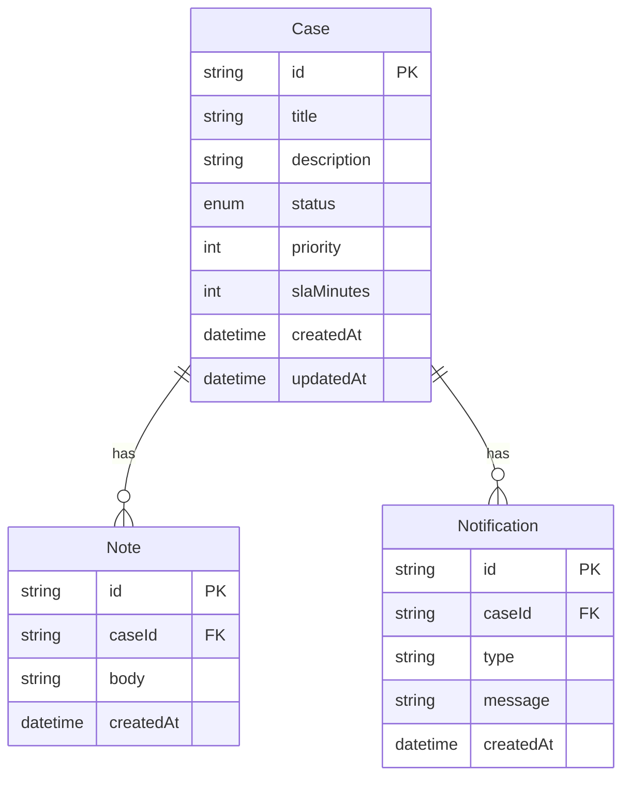

# Architecture Overview

## System Design

The Mini Case System is a full-stack application built with modern web technologies, designed to handle dealer support cases with SLA monitoring and automated breach detection.

### Core Components

#### 1. API Layer (`apps/api/`)

- **Runtime**: Bun (fast JavaScript runtime)
- **GraphQL**: Pothos for type-safe schema definition
- **Database**: Prisma ORM with PostgreSQL
- **Queue**: BullMQ with Redis for background jobs
- **Validation**: Zod for input validation

#### 2. Frontend (`apps/web/`)

- **Framework**: React 18 with TypeScript
- **Build Tool**: Vite for fast development and building
- **Styling**: Tailwind CSS for utility-first styling
- **Routing**: React Router for client-side navigation
- **GraphQL Client**: graphql-request for API communication

#### 3. Background Processing

- **Worker**: BullMQ worker for SLA breach detection
- **Scheduling**: Runs every minute to check for breached cases
- **Notifications**: Creates notification records when cases breach SLA

### Data Model



### Key Features

#### Case Management

- Create cases with configurable SLA and priority
- Add notes to track progress
- Update case status with validation
- Filter cases by status and priority

#### SLA Monitoring

- Automatic breach detection via background worker
- Configurable SLA per case (default 60 minutes)
- Status transitions: OPEN → IN_PROGRESS → RESOLVED
- BREACHED status for SLA violations

#### Status Flow

```
OPEN → IN_PROGRESS → RESOLVED
  ↓         ↓
BREACHED ← BREACHED
```

### Technology Choices

#### Why GraphQL over REST?

- **Type Safety**: Schema serves as contract between frontend/backend
- **Efficient Data Fetching**: Client requests only needed fields
- **Real-time Ready**: Easy to add subscriptions later
- **Developer Experience**: Auto-generated types and introspection

#### Why BullMQ over Cron?

- **Reliability**: Job persistence and retry mechanisms
- **Scalability**: Can run multiple workers
- **Monitoring**: Built-in job tracking and metrics
- **Integration**: Seamless with Node.js ecosystem

#### Why Bun over Node.js?

- **Performance**: Faster startup and execution
- **Built-in Tools**: Package manager, bundler, test runner
- **TypeScript**: Native TypeScript support
- **Compatibility**: Drop-in replacement for Node.js

### Deployment Architecture

#### Fly.io Deployment

- **Single App**: API and static frontend served from same container
- **PostgreSQL**: Fly Postgres for managed database
- **Redis**: Fly Redis for job queue
- **Auto-scaling**: Machines scale based on traffic

#### CI/CD Pipeline

- **GitHub Actions**: Automated testing and deployment
- **Multi-stage Build**: Optimized Docker images
- **Database Migrations**: Automated on deployment
- **Health Checks**: Container health monitoring

### Security Considerations

#### Current Implementation

- **Input Validation**: Zod schemas for all inputs
- **SQL Injection**: Prisma ORM prevents SQL injection
- **CORS**: Configured for frontend domain
- **Environment Variables**: Sensitive data in environment

#### Future Enhancements

- **Authentication**: JWT or session-based auth
- **Authorization**: Role-based access control
- **Rate Limiting**: API rate limiting
- **HTTPS**: SSL/TLS encryption

### Performance Optimizations

#### Database

- **Indexes**: On frequently queried fields
- **Connection Pooling**: Prisma connection management
- **Query Optimization**: Efficient GraphQL resolvers

#### Frontend

- **Code Splitting**: Route-based lazy loading
- **Caching**: GraphQL query caching
- **Optimistic Updates**: Immediate UI feedback

#### Background Jobs

- **Batch Processing**: Process multiple cases efficiently
- **Error Handling**: Retry failed jobs
- **Monitoring**: Job success/failure tracking

### Monitoring and Observability

#### Logging

- **Structured Logs**: JSON format for parsing
- **Request Tracing**: Track requests across services
- **Error Tracking**: Centralized error logging

#### Metrics

- **Case Metrics**: Creation, resolution, breach rates
- **Performance**: Response times, throughput
- **System Health**: Database, Redis, worker status

### Future Enhancements

#### Short Term

- **Real-time Updates**: WebSocket subscriptions
- **Email Notifications**: SLA breach alerts
- **File Attachments**: Case file uploads
- **Search**: Full-text search across cases

#### Long Term

- **Multi-tenancy**: Support multiple dealers
- **Advanced Analytics**: Case metrics and reporting
- **Mobile App**: React Native mobile client
- **AI Integration**: Automated case categorization
